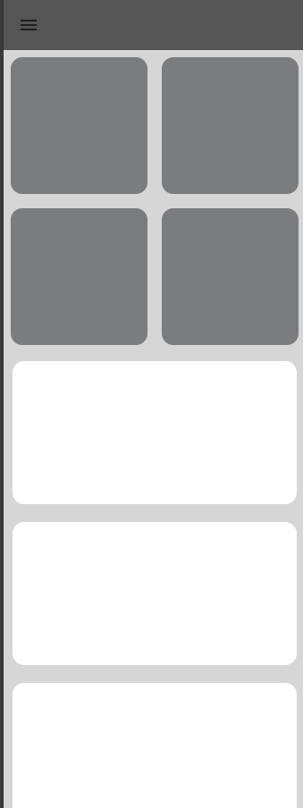
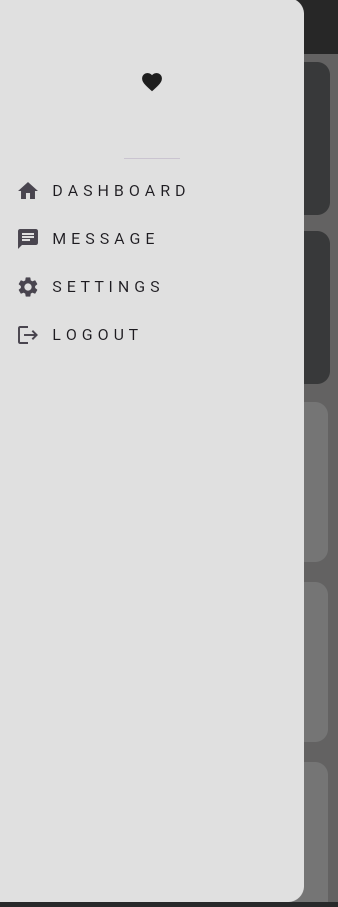
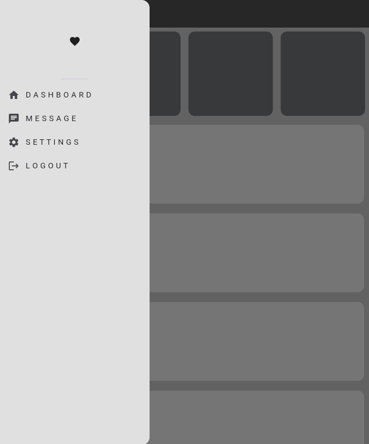
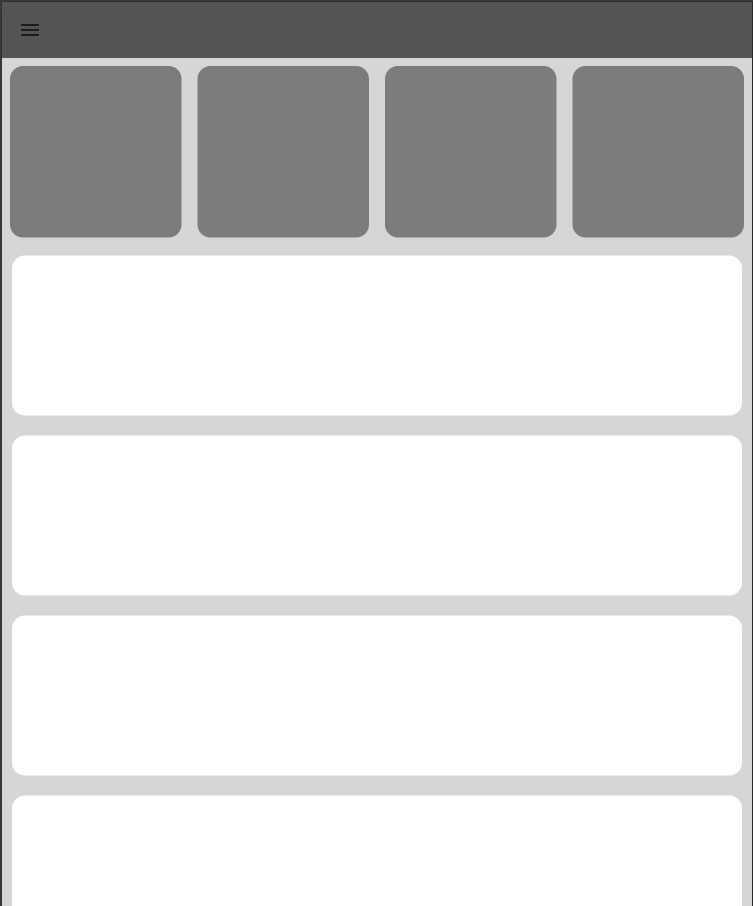
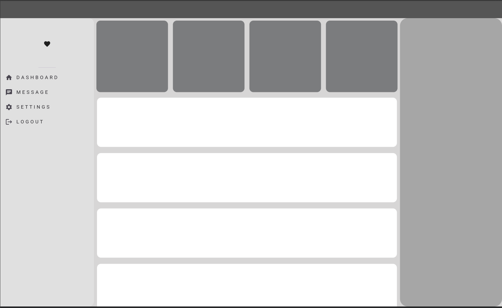

---

# Responsive Dashboard UI in Flutter 

🔗 Read Medium Article : [Medium](https://medium.com/@chathubandara500/getting-started-with-flutter-a-beginners-guide-87dfa07c531a)


🔗 Read LinkedIn Article : [LinkedIn](https://www.linkedin.com/posts/chathuminibandara_are-you-ready-to-embark-on-a-journey-into-activity-7254970391016701953-CR54?utm_source=share&utm_medium=member_desktop)


This project demonstrates a **responsive Flutter dashboard** that adapts to **mobile, tablet, and desktop** screens. It uses Flutter’s `LayoutBuilder` to adjust the UI based on the screen width, providing an optimized experience across various device types.

## Table of Contents
- [Introduction](#introduction)
- [Features](#features)
- [Technologies Used](#technologies-used)
- [Setup](#setup)
- [How it Works](#how-it-works)
  - [Mobile Layout](#mobile-layout)
  - [Tablet Layout](#tablet-layout)
  - [Desktop Layout](#desktop-layout)
- [Screenshots](#screenshots)
  - [Mobile](#mobile)
  - [Tablet](#tablet)
  - [Desktop](#desktop)
  - [Navigation Bar On/Off](#navigation-bar-onoff)
- [Contributing](#contributing)
- [License](#license)

## Introduction

This Flutter application demonstrates how to create a responsive layout for different device types: **mobile**, **tablet**, and **desktop**. The layout automatically adjusts based on the screen size using the `LayoutBuilder` widget. A dynamic **navigation bar** is included, with the ability to toggle its visibility.

## Features

- Responsive UI for mobile, tablet, and desktop.
- Separate navigation bar that can be toggled on and off.
- Clean, modern design that adapts seamlessly to different screen sizes.
- Uses Flutter's built-in `LayoutBuilder` for responsive design.

## Technologies Used

- **Flutter**: A UI toolkit for building cross-platform applications.
- **Dart**: The programming language used for Flutter development.
  
## Setup

To get started with this project, follow these steps:

1. Clone the repository:
    ```bash
    gh repo clone ChathuminiBandara/responsive_dashbord_ui    
    ```

2. Navigate to the project directory:
    ```bash
    cd responsive_dashboard_ui
    ```

3. Install the necessary dependencies:
    ```bash
    flutter pub get
    ```

4. Run the project:
    ```bash
    flutter run
    ```

## How it Works

### Mobile Layout
- Optimized for screens smaller than 500px in width.
- Provides a compact, vertical layout with navigation elements tailored for smaller devices.

### Tablet Layout
- Activates for screen sizes between 500px and 1100px.
- Utilizes the extra space by offering more components on the screen compared to the mobile view.

### Desktop Layout
- Designed for screens wider than 1100px.
- Fully leverages the horizontal space with a sidebar, more detailed navigation, and larger widgets.

## Screenshots

### Mobile
#### Navigation Bar On


#### Navigation Bar Off


### Tablet
#### Navigation Bar On


#### Navigation Bar Off


### Desktop
#### Navigation Bar On



## Contributing

Feel free to open issues or submit pull requests if you'd like to contribute to this project. Any contributions, such as bug fixes, feature requests, or improvements, are welcome.

## License

This project is licensed under the MIT License. See the [LICENSE](./license.txt) file for more details.


# Happy Coding ^_~

@ChathuminiBandara©™20241024


---


